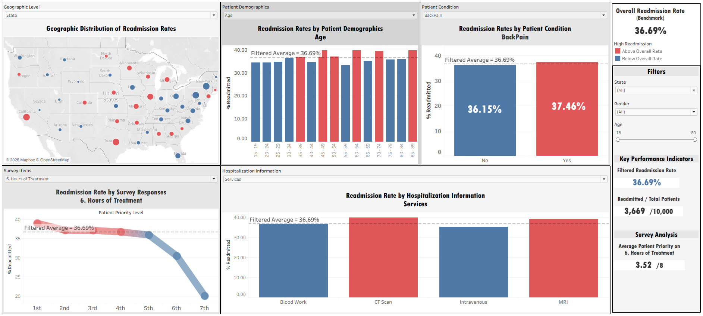
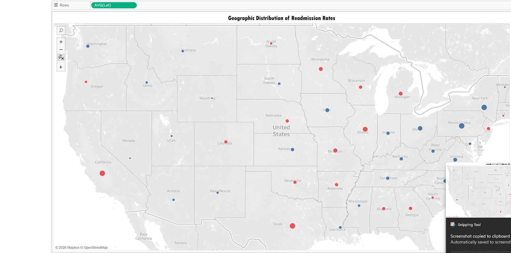
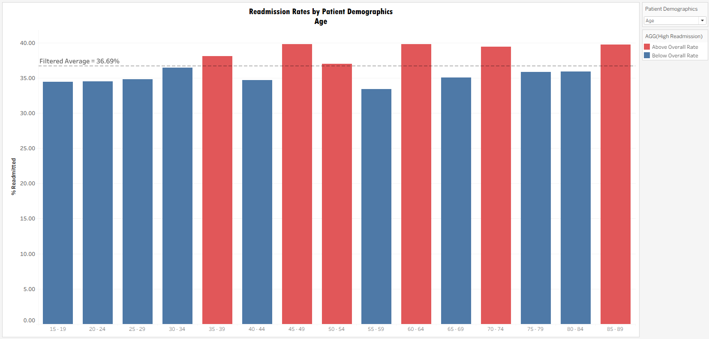
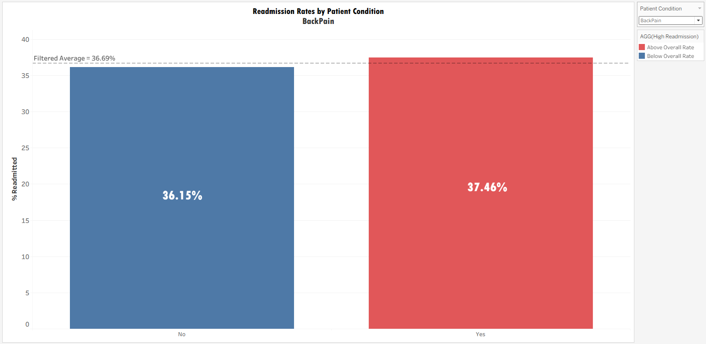
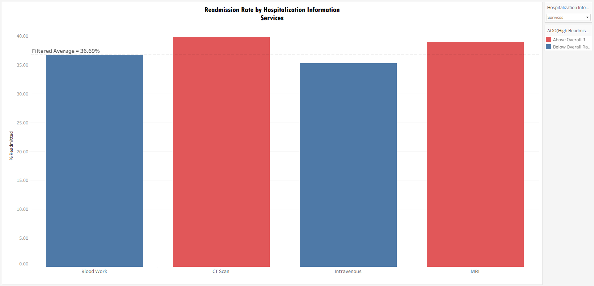
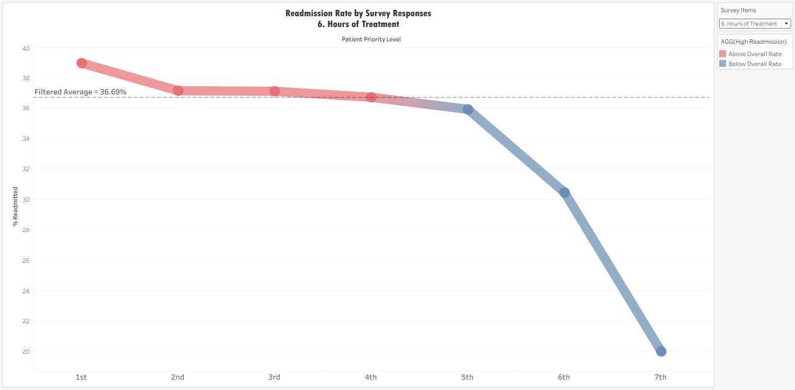

# Hospital Readmission Rate Dashboard — Tableau

An interactive Tableau dashboard built for executive leaders to explore hospital readmission rates across five analytical dimensions: geography, patient demographics, medical conditions, hospitalization details, and patient survey responses.

The goal is to make readmission patterns immediately readable by decision-makers who need to act on them — not by analysts who built them.

> **Note on Dataset Availability**
> The underlying patient dataset has been removed from this repository as it contains sensitive medical and personal information. The Tableau workbook (`.twbx`) with all visualizations is retained for presentation and portfolio purposes.

|  |

---

## Design Framework

Before building a single chart, three principles shaped every decision:

**1. A fixed benchmark as the single frame of reference**
The overall readmission rate across the full dataset is **36.69%**. This figure is calculated once, stays fixed regardless of applied filters, and serves as the baseline for all color coding. A dynamic benchmark would shift when filters change, making subgroup comparisons meaningless — you'd be comparing a group to a moving target. By anchoring all comparisons to the same number, every chart reads in the same language.

**2. Red–blue color scheme over a continuous gradient**
Red indicates above the 36.69% benchmark; blue indicates below. This binary encoding is intentional: it answers the most important executive question first — *is this good or bad?* — before any numbers are read. Red and blue are also the most reliable combination for the most common form of color vision deficiency (red-green), making the dashboard accessible without a separate design pass.

**3. Consistent y-axis scale across all bar charts**
Every bar chart uses readmission percentage on the y-axis, at a consistent scale. This eliminates the cognitive reset that happens when switching between charts with different axes — the eye can compare across views without recalibrating.

---

## Dashboard Components

### 1. Geographic Distribution (Map)

| Map View |
|---|
|  |

A U.S. map showing readmission patterns by location. Dot size reflects patient volume; dot color reflects the benchmark comparison.

**Design decision:** A dropdown lets users switch between Zip, City, County, and State granularity. Different decisions operate at different geographic scales — a state-level view informs policy, a zip-code view identifies neighborhood-level operational targets. One chart serves all four instead of requiring a separate dashboard per level.

---

### 2. Readmission by Patient Demographics (Bar Chart)

| Demographics |
|---|
|  |

Compares readmission rates across demographic segments. A dropdown switches between Age, Area, Income, Marital Status, and Gender.

**Design decision:** A *filtered average line* is overlaid on the chart, updating dynamically as filters are applied. This line shows the benchmark adjusted for the current selection — so if you filter to one state, the line reflects that state's average, not the national figure. It answers the question "is this subgroup high relative to its own context?" not just relative to the national rate.

---

### 3. Readmission by Medical Condition (Bar Chart)

| Conditions |
|---|
|  |

Compares readmission rates between patients with and without a specific condition (Diabetes, Stroke, Asthma, Anxiety, Back Pain, Overweight). A filtered average line is included.

**Design decision:** Rather than showing all conditions at once (which would require the viewer to hold six comparisons in mind simultaneously), one condition is selected at a time. This forces a cleaner, more answerable question: does this condition affect readmission for this population?

---

### 4. Readmission by Hospitalization Information (Bar Chart)

| Hospitalization Details |
|---|
|  |

Breaks down readmission rates by hospital stay details: Initial Admission type, Case Order, Services used, Total Charges, and Vitamin D levels. A filtered average line is included.

---

### 5. Readmission by Patient Survey Responses (Line Chart)

| Survey Responses |
|---|
|  |

Explores how patients' self-reported priorities — across 8 survey items (e.g., Timely Admission, Courteous Staff, Hours of Treatment) — relate to readmission rates.

**Why a line chart instead of a bar chart:** The x-axis is ordinal — importance ranks 1 through 8, where 1 = most important to the patient and 8 = least important. A line chart communicates that the x-axis has direction and sequence; a bar chart would imply the categories are unordered. The slope of the line is itself the insight: ascending means patients who cared *less* about this item had higher readmission rates; descending means those who cared *more* did.

---

## KPI Panel (Right Side)

All four KPIs update dynamically with applied filters, except the Overall Readmission Rate which remains fixed as the benchmark.

| KPI | Purpose |
|---|---|
| **Overall Readmission Rate** | Fixed benchmark (36.69%) — the anchor for all color coding |
| **Filtered Readmission Rate** | Current rate after active filters — how does the selected subgroup compare? |
| **Readmitted / Total Patients** | Absolute counts alongside the rate — critical for avoiding small-sample misinterpretation |
| **Avg. Patient Priority on Survey Item** | Mean importance score (1–8) for the selected survey question — updates per item |

**Design decision on absolute counts:** A readmission rate of 75% sounds alarming. If it refers to 3 out of 4 patients in a tightly filtered segment, it carries no statistical weight. Displaying the raw count next to the rate gives executives the context to judge whether a percentage is meaningful or noise.

---

## Storytelling Elements

The dashboard applies three deliberate data storytelling techniques:

- **Benchmarking:** The fixed 36.69% rate provides a constant reference point, allowing immediate judgment of any data point without manual comparison.
- **Interactivity:** Filters and dropdowns let leaders pose their own questions — shifting from a one-size presentation to a self-directed investigation.
- **Consistency of scale:** Uniform y-axes across charts reduce cognitive load and make cross-dimensional comparisons possible without re-reading axis labels.

---

## How to Use

### Requirements
- **Tableau Desktop** or **Tableau Reader** (free) — ask your IT team to install Tableau Reader if needed.

### Steps
1. Open the `.twbx` file in Tableau Desktop or Reader.
2. Use the **right-side panel** to filter by Age, Gender, or State.
3. Use **dropdown menus** above each chart to switch analytical dimensions.
4. **Red** = above benchmark · **Blue** = below benchmark.
5. **Hover** over any data point to see detailed statistics in the tooltip.

---

## Project Structure

```
project/
├── Screenshots/          # Dashboard component screenshots
├── [workbook].twbx       # Tableau packaged workbook (retained)
└── README.md
```

---

## Tech Stack

`Tableau Desktop` · `Tableau Reader` · `Tableau Calculated Fields` · `Tableau Parameters`
